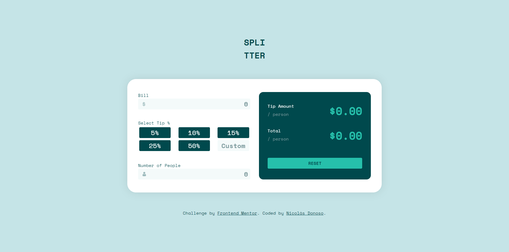

# Frontend Mentor - Tip calculator app solution

This is a solution to the [Tip calculator app challenge on Frontend Mentor](https://www.frontendmentor.io/challenges/tip-calculator-app-ugJNGbJUX). Frontend Mentor challenges help you improve your coding skills by building realistic projects.

## Table of contents

- [Overview](#overview)
  - [The challenge](#the-challenge)
  - [Screenshot](#screenshot)
  - [Links](#links)
- [My process](#my-process)
  - [Built with](#built-with)
  - [What I learned](#what-i-learned)
- [Author](#author)
- [Acknowledgments](#acknowledgments)

**Note: Delete this note and update the table of contents based on what sections you keep.**

## Overview

### The challenge

Users should be able to:

- View the optimal layout for the app depending on their device's screen size
- See hover states for all interactive elements on the page
- Calculate the correct tip and total cost of the bill per person

### Screenshot

### Links

- Solution URL: [Frontend Mentor Solution](https://www.frontendmentor.io/solutions/tip-calculator-app-IkxgKovrOg)
- Live Site URL: [Github Page](https://sir-floppa.github.io/Frontend-Mentor-05-Tip-Calculator-App/)

## My process

### Built with

- HTML
- CSS custom properties
- Flexbox
- CSS Grid
- Angular

### What I learned

With this one I reinforced the interaction between sibling components and the basics of using CSS Grid.

## Author

- Website - [Nicolás Donoso](https://sir-floppa.github.io)
- Frontend Mentor - [@Sir-Floppa](https://www.frontendmentor.io/profile/Sir-Floppa)
- Instagram - [@sir_floppa](https://www.instagram.com/sir_floppa/)

